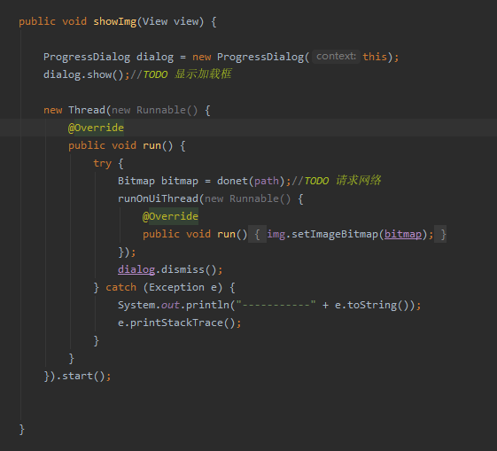
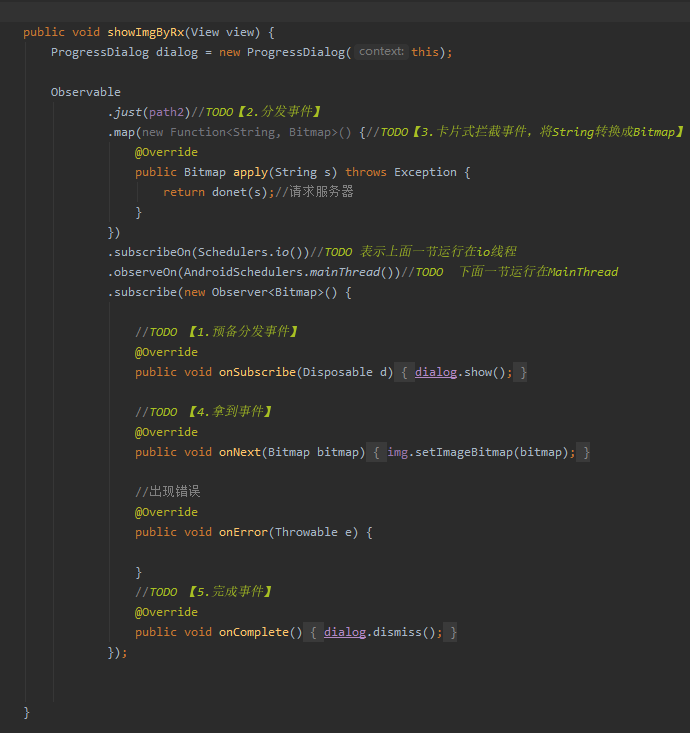
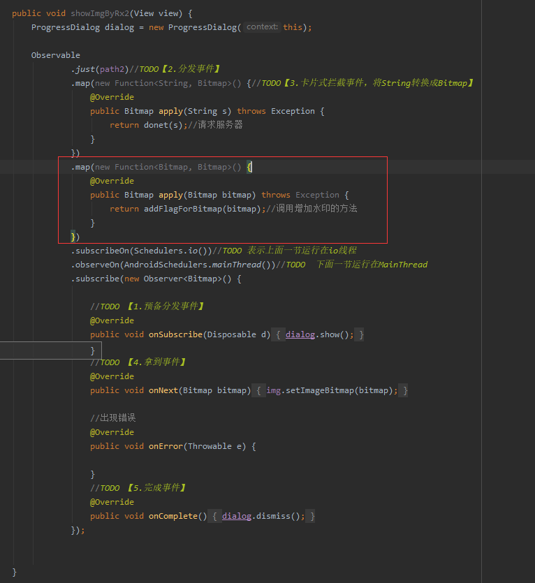
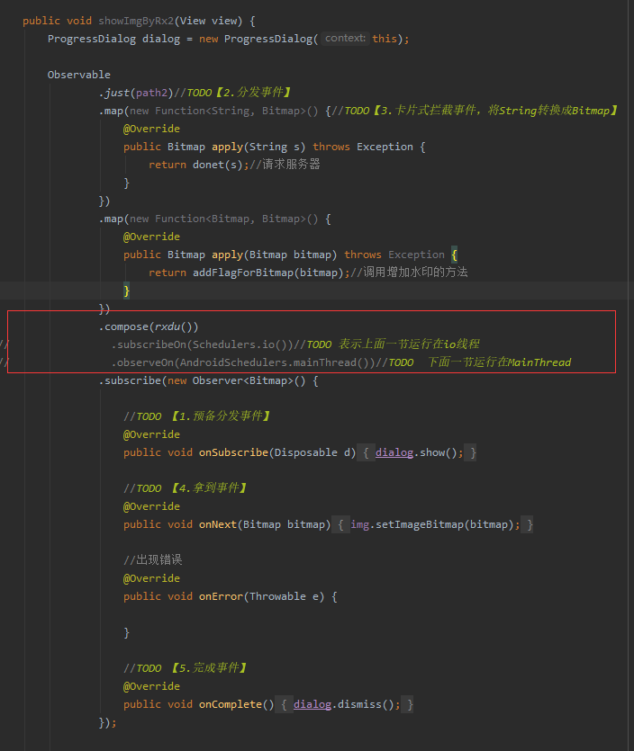

# Rxjava
> Demo 小例子：传统请求网络 VS  RXJava方式

请求一张网络图片，然后设置在ImageView上

**传统方式：**




**RxJava方式：**



通过上面的对比，可以看到传统方式实现上代码结构不够清晰，而RxJava方式实现整个思维是比较清晰的，成链式的。

下面对上面Rx部分代码一些值得注意的地方作一下说明：

1. onSubscribe 表示此时预备要发送事件了,**这是第一步，**
2. Observable.just表示发送事件，这是第二步
3. map表示拦截转换事件，将String转换成Bitmap,这是第三步
4. onNext表示下游拿到最终事件了，这是第四步
5. onComplete标志事件完成,这是最后一步
6. onError当错误发生的时候回调


<u>*另外两个不可以忽视的点：*</u>

1. **subscribeOn(Schedulers.io())**  表示这句代码以上的代码运行在io线程中
2. **observeOn(AndroidSchedulers.mainThread())**  表示这句代码以下的代码运行在主线程


> Rxjava 编程有什么好处

从上面例子看到，相较于传统方式实现，RX方式思维更加直观连续，成链式，一步接一步，这样在处理需求变更更很有好处，举个例子：比如现在图片从网络下载后要加水印再显示，使用Rx方式则很轻松如下：



只需要增加上图红色圈中的部分，整个思维十分清晰


> 封装 .subscribeOn(Scheduler.io()).observeOn(AndroidSchedulers.mainThread())

```java
 .subscribeOn(Scheduler.io())
 .observeOn(AndroidSchedulers.mainThread())
```

上面这个代码在指定线程时候会经常用到，每次都要这么写挺麻烦，可以使用ObservableTransformer来封装，如下：

```java
public static <UD>ObservableTransformer<UD,UD> rxdu() {
    return new ObservableTransformer<UD,UD>() {
        @Override
        public ObservableSource<UD> apply(Observable<UD> upstream) {
            return upstream.subscribeOn(Schedulers.io())//TODO 表示上面一节运行在io线程
                    .observeOn(AndroidSchedulers.mainThread());//TODO  下面一节运行在MainThread
        }
    };
}
```

**如何使用?**需要配合compose,如下：




> Consumer 与 Observer

```java
public interface Consumer<T> {
 
    void accept(T t) throws Exception;
}
```


```java
public interface Observer<T> {

    void onSubscribe(@NonNull Disposable d);

    void onNext(@NonNull T t);

    void onError(@NonNull Throwable e);

    void onComplete();

}
```

对比可以看到Consumer的accept相当于observer的onNext,observer还有其他状态的回调，比如onSubscribe表示事件预备发送时还没发送前，onComplete表示事件结束，onError表示回调，所以当我们需要展示进度条之类的需求时应该选择Observer，如果不关心出错等其他状态只关心最后结果可以使用Consumer


> RxJava使用场景：搭配Retrofit

【2】06：59