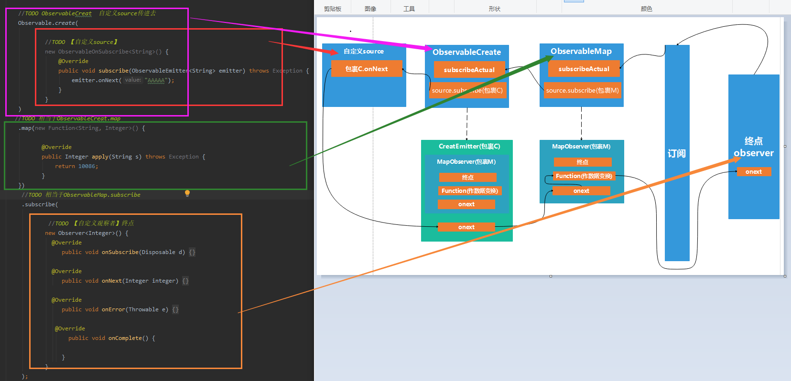
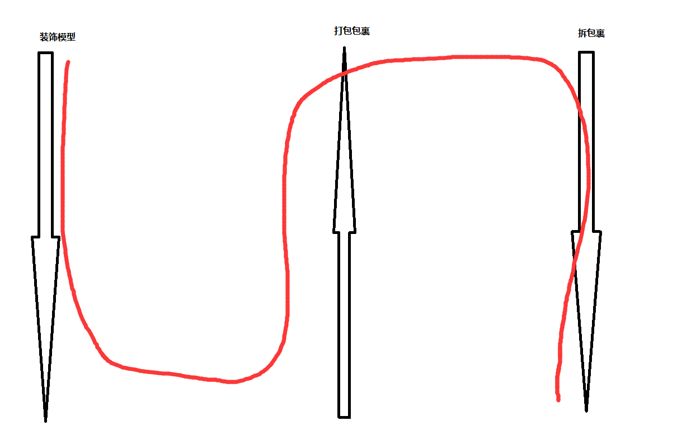

> Rxjava的Hook点

```java
Observable.just("")
        .subscribe(new Consumer<String>() {
            @Override
            public void accept(String s) throws Exception {

            }
        });
```

比如调用Observable.just("")，实际上是创建了ObservableJust

```java
  public static <T> Observable<T> just(T item) {
        ObjectHelper.requireNonNull(item, "item is null");//检查空值
        return RxJavaPlugins.onAssembly(new ObservableJust<T>(item));//创建ObservableJust
    }

```

见上面代码，创建ObservableJust对象后，还会使用RxJavaPlugins.onAssembly包装它，如下：

```java
   public static <T> Observable<T> onAssembly(@NonNull Observable<T> source) {
       //TODO 默认onObservableAssembly是空的，下面if代码块不执行
        Function<? super Observable, ? extends Observable> f = onObservableAssembly;
        if (f != null) {
            return apply(f, source);
        }
        return source;
    }
```

默认onObservableAssembly是空的，if代码块是不执行，实际上onAssembly是相当于预留了后门，方便Hook作全局控制，因为onAssembly是静态的方法，实际上在使用各种操作符的过程，是发生下图所示的过程


> RxJava的观察者模式

```java
        //TODO 【1】创建一个被观察者
        Observable observable=   Observable.create(new ObservableOnSubscribe<String>() {
            @Override
            public void subscribe(ObservableEmitter<String> emitter) throws Exception {
                emitter.onNext("AAAAA");
            }
        });
        
        //TODO【2】 创建一个观察者
        Observer observer =  new Observer<String>() {
            @Override
            public void onSubscribe(Disposable d) {

            }

            @Override
            public void onNext(String s) {

            }

            @Override
            public void onError(Throwable e) {

            }

            @Override
            public void onComplete() {

            }
        };
        
        //TODO 【3】观察者订阅被观察者
        observable.subscribe(observer);
```

 首先看第一步【1】创建一个被观察者

```java
public static <T> Observable<T> create(ObservableOnSubscribe<T> source) {
        ObjectHelper.requireNonNull(source, "source is null");//TODO  空值检查
        //TODO onAssembly---是全局Hook预留操作
        //TODO 可以看到creat方法会创建一个ObservableCreate对象
        //TODO 并且传入一个参数source，属于ObservableOnSubscribe<T>类型
        return RxJavaPlugins.onAssembly(new ObservableCreate<T>(source));
    }
```

```java
public interface ObservableOnSubscribe<T> {
    
    void subscribe(@NonNull ObservableEmitter<T> emitter) throws Exception;
}
```

执行完上面代码，一个Observable持有一个ObservableOnSubscribe：


 【2】 创建一个观察者


```java
【3】观察者订阅被观察者
observable.subscribe(observer);
```

```java
  public final void subscribe(Observer<? super T> observer) {
      //TODO 空值校验，不是重点
        ObjectHelper.requireNonNull(observer, "observer is null");
        try {
            
            observer = RxJavaPlugins.onSubscribe(this, observer);
    //TODO 空值校验，不是重点
            ObjectHelper.requireNonNull(observer, "The RxJavaPlugins.onSubscribe hook returned a null Observer. Please change the handler provided to RxJavaPlugins.setOnObservableSubscribe for invalid null returns. Further reading: https://github.com/ReactiveX/RxJava/wiki/Plugins");
            
		//TODO【关键】 调用了subscribeActual
            subscribeActual(observer);
        } catch (NullPointerException e) { // NOPMD
            throw e;
        } catch (Throwable e) {
            Exceptions.throwIfFatal(e);
            // can't call onError because no way to know if a Disposable has been set or not
            // can't call onSubscribe because the call might have set a Subscription already
            RxJavaPlugins.onError(e);

            NullPointerException npe = new NullPointerException("Actually not, but can't throw other exceptions due to RS");
            npe.initCause(e);
            throw npe;
        }
    }
```

可以看到接着会调用抽象方法的subscribeActual，这个例子中是调用ObservableCreate的subscribeActual方法，如下：

```java
   protected void subscribeActual(Observer<? super T> observer) {
       //ToDO 创建一个发射器
        CreateEmitter<T> parent = new CreateEmitter<T>(observer);
       //TODO 调用 observer的onSubscribe方法，
       //TODO 这就是为什么事件还没开始发射，observer的onSubscribe方法
       //TODO 就被回调的原因
        observer.onSubscribe(parent);

        try {
            //TODO  这里的source是什么？
            //就是Observable持有的ObservableOnSubscribe类型对象
            //并将发射器作为参数传入
            source.subscribe(parent);
        } catch (Throwable ex) {
            Exceptions.throwIfFatal(ex);
            parent.onError(ex);
        }
    }
```

到此为止这个过程的调用可以用下图表示：


> 标准的观察者模式 VS   RXJava的观察这模式

**标准的观察者模式：**

只有一个被观察者，多个观察者，被观察者改变发出通知后观察者才能观察到

**RxJava观察者模式：**

多个被观察者，一个观察者，需要起点和终点在一次订阅之后，才能发出通知，终点（观察者）才能观察到。


相比于标准的观察者模式，RxJava的观察者模式更加解耦，被观察者不必持有观察者，而是通过一个抽象层发射器来转发通知观察者。


> RxJava原理分析

这里以map举例分析，代码如下：


上面代码执行流程可以用下图表示：


代码与执行流程图对应关系，如下：



详细分析如下：

调用subscribe订阅方法，实际上调用的是ObservableMap的subscribe,传入了终点也就是观察者，subscribe是继承自基类Observable：

```java
  【Observable】
  
public final void subscribe(Observer<? super T> observer) {
       //TODO 这里省略很多判空代码
       //TODO 可以看到会调用subscribeActual，它是抽象方法
       //TODO 由具体子类实现，本例中是调用ObservableMap的
       //TODO subscribeActual
        subscribeActual(observer);
    }
```


```java
 【ObservableMap】

public void subscribeActual(Observer<? super U> t) {
		
        source.subscribe(new MapObserver<T, U>(t, function));
}
```

首先创建了MapObserver对象，这个对象把t,function给打包了，t 是什么就是终点，function是什么就是map实现数据变化的接口。另外一个问题这里的source又是什么？source实际上是上游的Observable，在本例中当前处于ObservableMap，它的上游是谁？是ObservableCreate,我们看看ObservableCreate调用.map生成ObservableMap是如何把自己设置成source的：

```java
【Observable】
 public final <R> Observable<R> map(Function<? super T, ? extends R> mapper) {
        ObjectHelper.requireNonNull(mapper, "mapper is null");
        //TODO 直接new
        return RxJavaPlugins.onAssembly(new ObservableMap<T, R>(this, mapper));
    }
```

上面可以看到是直接new一个ObservableMap，并且将自身传入：

```java
   
【ObservableMap】
public ObservableMap(ObservableSource<T> source, Function<? super T, ? extends U> function) {
        super(source);
        this.function = function;
    }
```

到目前位置流程图已经走到以下这样了：


接着上面说到的source也就是ObservableCreat，调用了subscribe方法，并传入包裹M——MapObserver,这样流程就从ObservableMap走到了ObservableCreat来，同样的调用subscribe方法最终会调用subscribeActual：

```java
 【ObservableCreat】
 
 protected void subscribeActual(Observer<? super T> observer) {
 		//TODO 1
        CreateEmitter<T> parent = new CreateEmitter<T>(observer);
        //TODO 2
        observer.onSubscribe(parent);
        //TODO 3
        source.subscribe(parent);
     
    }
```

【TODO 1】

创建"包裹C"——CreateEmitter，observer实际上是包裹M——MapObserver,所以"包裹C"——CreateEmitter是包裹M的基础上再包裹一层


【TODO 3】

首先要搞清楚source是谁？是上游，一开始调用.creat时传进来的自定义source:

```java
    public static <T> Observable<T> create(ObservableOnSubscribe<T> source) {
        ObjectHelper.requireNonNull(source, "source is null");
        return RxJavaPlugins.onAssembly(new ObservableCreate<T>(source));
    }
```

```java
   public ObservableCreate(ObservableOnSubscribe<T> source) {
        this.source = source;
    }
```

到目前位置流程图已经走到以下这样了：


所以调用 source.subscribe(parent)则是来到自定义Source:


接着开始调用emitter.onNext,这里的emitter实际上是“包裹C”----CreateEmitter,调用onNext其实是一个拆包裹的过程：

```java
  【CreateEmitter】    
@Override
public void onNext(T t) {
            if (t == null) {
                onError(new NullPointerException("onNext called with null. Null values are generally not allowed in 2.x operators and sources."));
                return;
            }
            if (!isDisposed()) {
            //TODO 1
                observer.onNext(t);
            }
  }
```

【TODO 1】

这个observer是谁？实际上是“包裹C”----CreateEmitter里面包裹的东西，见图：


上图红色圈中的是同一个对象，observer其实就是包裹M,这一点上文有过分析。

所以调用observer.onNext流程就来到了MapObserver,如下：

```java
【MapObserver】

static final class MapObserver<T, U> extends BasicFuseableObserver<T, U> {
        final Function<? super T, ? extends U> mapper;

		//TODO 1
       MapObserver(Observer<? super U> actual, Function<? super T, ? extends U> mapper) {
            super(actual);
            this.mapper = mapper;
        }

        @Override
        public void onNext(T t) {
            if (done) {
                return;
            }

            if (sourceMode != NONE) {
                downstream.onNext(null);
                return;
            }

            U v;

            try {
            //TODO 2
                v = ObjectHelper.requireNonNull(mapper.apply(t), "The mapper function returned a null value.");
            } catch (Throwable ex) {
                fail(ex);
                return;
            }
            //TODO 3
            downstream.onNext(v);
        }
```

【TODO 1】

从上文一开始包裹M的打包生成过程可以知道，Observer<? super U> actual 实际上就是终点， Function<? super T, ? extends U> mapper实际上就是数据变换接口


【TODO 2】

调用mapper.apply(t)，将T类型转换成U类型，


【TODO 3】

downstream又是谁，downstream实际上就是actual ，只不过是换了一个引用名称，都指向终点


所以调用downstream.onNext(v)会导致终点的onNext被调用：


到此为止整个流程都走完了，Rxjava执行流程实际就是一个U型：


**总结：**

一订阅，执行流程从下（相对于代码终点来说）往上走，然后开始打包包裹，在map中把终点打包生成一个新的包裹----包裹M，继续往上走到creat,开始对包裹M打包生成新包裹----包裹C,继续往上走来到顶层的自定义source,

开始拆包郭，往下走，调用包裹C的onNext，在onNext中继续拆包裹，调用包裹M的onNext，继续拆，调用终点的onNext，到此事件流向完成。

整个过程就是**“先从下往上，再从上往下”**，**从下往上是打包包裹，从上往下是拆包裹**，这样打包包裹--拆包裹的设计思路就是为了实现卡片式编程，从起点到终点，保持思维不断，再多的卡片都没关系。


> RxJava的装饰模型

上文提到RxJava执行流程是一个**从下往上再从上往下**的**U型**结构，实际上不太准确，RxJava的执行流程更应该说是一个S型。

**装饰模型**


上面代码在定义初始化的时候就是从上往下的一层包裹一层，有点像装饰模式但不是真的设计模式，所以说是装饰模型，或者说是洋葱模型。

上文说过Rxjava再执行的时候是U型，再加上这个代码定义初始化的从上往下，就整体形成了S型：

